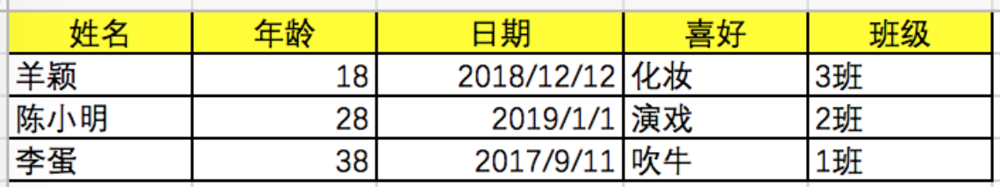
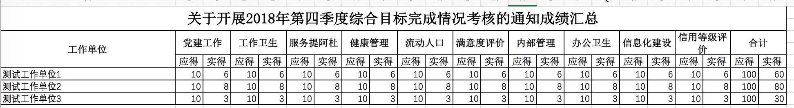
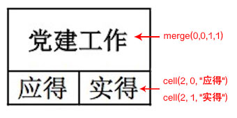
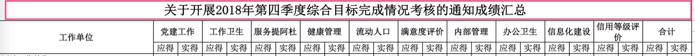

# 项目用途
封装了Excel POI的接口，可以将 Excel 中的每一行转换为对应的 Bean，也可以将 List 直接输出为 Excel。

# 使用方法
## 基础
首先引入 java 依赖：

```xml
<dependency>
    <groupId>me.qping.utils</groupId>
    <artifactId>ExcelUtil</artifactId>
    <version>1.0-SNAPSHOT</version>
</dependency>
```

假设导入的 excel 如下图 ：



定义与excel对应的bean，通过注解 `@excel` 来定义 bean 和 excel 的关联关系。`name` 为表头名称，也可以通过列的位置 `index` ，`index`  从 0 开始。

``` java
@Data
public class ClassMate {
    @Excel(name = "姓名")
    String name;

    @Excel(name = "年龄")
    int age;

    @Excel(name = "日期")
    Date date;

    @Excel(name = "喜好")
    String hobby;

    @Excel(index = 4)
    String className;  
}
```


## 简单的导入

调用 ExcelUtil.read 来读取数据， `ExcelUtil` 会自动识别 `xls` 和 `xlsx` 格式。

``` java
ExcelUtil util = new ExcelUtil();
Collection<ClassMate> list = util.read(ClassMate.class, "/path/to/classmates.xlsx");
```

除了通过文件路径来读取，还可以使用 inputstream。

``` java
Collection<ClassMate> list = util.read(ClassMate.class, inputstream);
```

如果没有第一行直接是数据，而不是标题行时：（  `@excel` 注解只能使用`index` 来标注关系 ）

``` java
Collection<ClassMate> list = util.firstHeader(false).read(ClassMate.class, "/path/to/classmates.xlsx");
```

如果不想定义excel对应的bean
```
List<Map<Integer,Object>> data = util.read(new FileInputStream("/path/to/classmates.xlsx"));
```

## 多sheet页导入

可以指定读取某一个 sheet 页的数据

```
ExcelUtil util = new ExcelUtil();
 
Collection<ClassMate> list0 = util.sheetNo(0)
        .read(ClassMate.class, "/path/to/classmates.xlsx");

Collection<ClassMate> list1 = util.sheetNo(1)
        .read(ClassMate.class, "/path/to/classmates.xlsx");
```

也可以批量读取 sheet 页面的数据，通过实现  `Consumer`  接口，来实现读取每个 sheet 页面数据后功能实现。

```
new ExcelUtil().readEachSheet(ClassMate.class, inputStream, new Consumer<ClassMate>() {
    @Override
    public void execute(Collection<ClassMate> data, Config context) {
    		System.out.println(data.size());
    }
});
```


## 简单的导出

调用 ExcelUtil.write 来导出 excel， `ExcelUtil` 会自动识别路径中的 `xls` 和 `xlsx` 格式。

``` java
List<ClassMate> data = new ArrayList<>();
new ExcelUtil().write(ClassMate.class, "/path/to/out.xlsx", list);
```

还有其他参数形式，除了使用导出文件路径，也可以使用 outputstream

``` java
new ExcelUtil().write(ClassMate.class, outputStream, list, "xls");
```


# 复杂表头的导出

## 思考

当面对如下的复杂表头编写时，poi 提供两个接口来实现。

第一个是设置单元格内容：

``` java
Row row = sheet.createRow(rowIndex);
Cell cell = row.createCell(colIndex);
cell.setCellValue("测试");
```

第二个是合并单元格，合并后显示第一个单元格的内容。

``` java
CellRangeAddress cellRange = new CellRangeAddress(beginRow, endRow, beginCol, endCol);
sheet.addMergedRegion(cellRange);
```

当表头特别复杂时，需要不停的移动 row 和 col 来设置内容，其实以上的复杂表头是有规律的，部分内容不停的重复。那怎么来抽像共通点呢？

最终实现参考了 div 的概念。 在html 布局中，定义大小各异的 div ，使用 float 等属性，这些小方块就自然靠在了一起。我们只需要关心 div 和 div 之间是垂直排列，还是水平排列，而不用关心每个 div 的具体的坐标值。


## 实现：ExcelDiv 和 ComplexUtil 的使用示例




定义一个高度为3，宽度为2 的小方块。（占 2 列3 行）

``` java
int width = 2, height = 3;
ExcelDiv div = ExcelDiv.create(width, height);
```



上面这个方块，可以分为一个合并单元格和两个小单元格组成。

``` java
ExcelDiv measure = ExcelDiv.create(2,3)
                .merge(0, 0, 1, 1, "党建工作")
                .cell(2, 0, "应得")
                .cell(2, 1, "实得");
```

很多个这样小方块，水平排列就组成了一个整体，通过 `ComplexUtil.horizontal()` 可以将这些小方块水平合为一体，代码实现如下：

``` java
String[] nameArr = new String[]{
  "每日工作","卫生服务","健康管理","流动人口", "满意度评价","内部管理", "合计"
};

List<ExcelDiv> list = new ArrayList<>();

ExcelDiv orgDiv = ExcelDiv.create(1, 3).merge("工作单位");
list.add(orgDiv);

for(String name : nameArr){
    ExcelDiv div = ExcelDiv.create(2,3)
            .merge(0, 0, 1,1, name)
            .cell(2, 0, "应得")
            .cell(2, 1, "实得");         
    list.add(div);
}
ExcelDiv longDiv = ComplexUtil.horizontal(list);

```




这个很长的标题和下面的方块间是上下关系，通过 `ComplexUtil.vertical()` 可以将小方块上下合为一体，代码如下：

``` java
ExcelDiv title = ExcelDiv.create(longDiv.getWidth(), 2)
                .merge("关于开展2018年第四季度综合目标完成情况考核的通知");
                
ExcelDiv complexHeader = ComplexUtil.vertical(title, longDiv);
```


最后调用 `ComplexUtil.draw()` 方法，可以导出 excel。

``` java
ComplexUtil.draw(new FileOutputStream(new File("/path/to/1.xls")), complexHeader);
```

导出带数据的复杂表头方法：
``` java
 Clazz clazz = T.class;
 List<T> data = ...;
 String fileExt = "xlsx"; // 可选值 xlsx / xls
 boolean needSimpleHeader = true;
 ComplexUtil.draw(outputStream, complexHeader, clazz, data, "xlsx", needSimpleHeader);
```


## 方法说明：

| 方法                                           | 说明                                                         |
| ---------------------------------------------- | ------------------------------------------------------------ |
| ExcelDiv.create(width, height)                 | 构建一个方块                                                 |
| .merge(beginRow,beginCol,endRow,endCol,remark) | 合并单元格,从开始坐标到结束坐标间合并                        |
| .merge(remark)                                 | 合并当前方块                                                 |
| .cell(row, col, remark)                        | 指定某个坐标的单元格内容                                     |
| .cell(remark)                                  | 在当前方块内，指定单元格内容。第一个次执行时指定第一行第一列的单元格。第二次执行时指定第一行第二列的单元格。每次执列索引+1 |
| .append(excelDiv, direction)                   | 在右边或者下边追加一个方块。新方块的高度等于两者高度相加，宽度等于两者宽度相加。direction可选值 10 或者 20，分别代表右侧或者下方 |

静态方法

| 方法                                     | 说明                                                         |
| ---------------------------------------- | ------------------------------------------------------------ |
| ComplexUtil.vertical(List\<ExcelDiv\>)   | 将多个方块垂直合并，新方块的高度等于所有方块高度的和，宽度等于所有方块宽度的和。 |
| ComplexUtil.horizontal(List\<ExcelDiv\>) | 将多个方块水平合并，新方块的高度等于所有方块高度的和，宽度等于所有方块宽度的和。 |
| ComplexUtil.draw(outputStream, ExcelDiv) | 将方块写入到输出流，生成excel                                |

